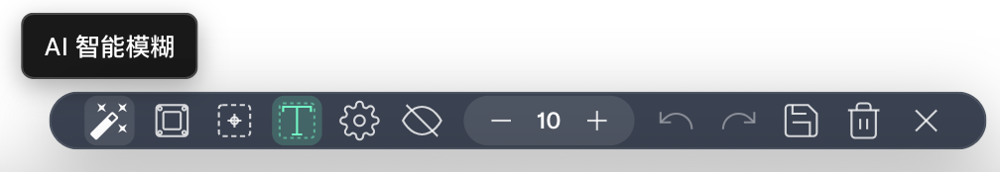
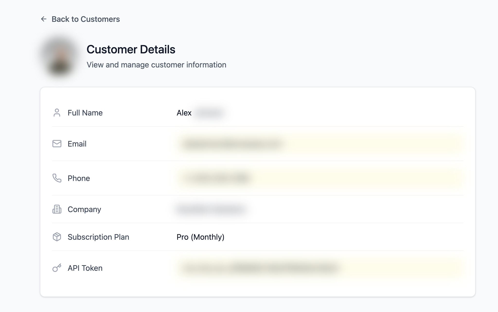

# 模糊助手

**智能网页敏感信息模糊保护工具**

## 📖 项目简介

BlurMate 是一款功能强大的浏览器扩展，专为保护网页中的敏感信息而设计。它结合了传统规则匹配和先进的AI技术，能够智能识别并模糊处理页面中的隐私数据，为用户提供全面的隐私保护解决方案。

### 🎯 核心价值

- **隐私保护**：防止敏感信息在屏幕共享、截图时泄露
- **智能识别**：AI驱动的敏感信息自动检测
- **灵活操作**：支持手动选择和批量处理
- **数据持久化**：模糊状态可保存和自动恢复
- **用户友好**：直观的界面和流畅的操作体验

## ✨ 功能特性

### 🤖 AI智能模糊
- **多AI模型支持**：集成DeepSeek、Kimi、ChatGPT、Gemini等主流AI模型
- **智能识别**：自动识别姓名、地址、工作单位等复杂敏感信息
- **规则匹配**：内置身份证、手机号、银行卡、邮箱等常见敏感信息规则
- **自定义规则**：支持用户添加正则表达式规则
- **批量处理**：一键智能模糊页面中所有敏感信息

### 🎨 手动模糊模式
- **DOM元素模式**：点击选择页面元素进行精确模糊
- **文本选择模式**：选择文本后一键模糊
- **区域选择模式**：拖拽创建矩形区域模糊
- **强度控制**：1-50级可调节模糊强度
- **实时预览**：鼠标悬停显示模糊效果预览

### 💾 数据管理
- **状态保存**：模糊状态可保存到本地存储
- **自动恢复**：页面刷新后自动恢复已保存的模糊状态
- **数据透明**：在设置页面查看所有保存的模糊数据
- **精细管理**：支持删除单个元素、整个网站或所有数据
- **数据统计**：显示网站标题、URL、模糊数量和修改时间
- **自动恢复**：页面刷新后自动恢复已保存的模糊状态
- **URL关联**：以页面URL为单位管理模糊数据
- **早期加载**：页面加载时显示蒙版，避免敏感信息泄露
- **撤销重做**：支持最近10次操作的撤销和重做

### 🌍 用户体验
- **多语言支持**：中文、英文、日文、繁体中文
- **响应式设计**：适配不同屏幕尺寸和设备
- **快捷键支持**：ESC键快速退出模糊模式
- **状态提示**：清晰的操作反馈和状态指示
- **无缝集成**：不影响原网页功能和布局

## 🚀 安装使用

### 系统要求
- Chrome 88+ 或其他基于Chromium的浏览器
- 支持Manifest V3的浏览器环境

### 安装方式

#### 开发者模式安装
1. 下载最新版本的扩展包
2. 打开Chrome扩展管理页面 (`chrome://extensions/`)
3. 开启"开发者模式"
4. 点击"加载已解压的扩展程序"
5. 选择解压后的扩展目录

### 快速开始

1. **激活工具栏**
   - 点击浏览器工具栏中的BlurMate图标
   - 页面底部将显示模糊工具栏

2. **选择模糊模式**
   - **DOM模式**：点击页面元素进行模糊
   - **文本模式**：选择文本后点击模糊按钮
   - **区域模式**：拖拽创建矩形模糊区域

3. **AI智能模糊**
   - 点击设置配置AI模型和API密钥
   - 点击AI智能模糊按钮自动识别敏感信息

4. **保存和恢复**
   - 点击保存按钮保存当前模糊状态
   - 页面刷新后自动恢复已保存的模糊效果

5. **数据管理**
   - 在设置页面查看"模糊数据管理"部分
   - 查看所有网站的模糊数据统计
   - 删除不需要的模糊元素或网站数据
   - 一键清空所有保存的模糊数据

### AI模型配置
1. 打开扩展设置页面
2. 在"AI模型配置"部分：
   - 启用AI功能
   - 选择AI模型（DeepSeek、Kimi、ChatGPT、Gemini）
   - 输入对应的API密钥
   - 可选：自定义AI提示语

### 规则配置
1. 在"规则模糊配置"部分：
   - 启用规则功能
   - 选择需要的内置规则
   - 添加自定义正则表达式规则

## 🔄 更新日志

### v1.0.0 (2024-12-22)
- ✨ 首次发布
- 🤖 AI智能模糊功能
- 🎨 三种手动模糊模式
- 💾 数据持久化和自动恢复
- 🌍 多语言支持
- 📱 响应式设计
- 🔧 完整的配置系统
- 🔐 双版本授权系统（国际版 + 国内版）
- 📦 优化的构建流程和打包方式

---
