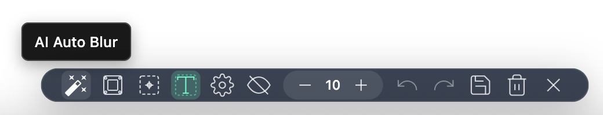

# BlurMate

**Intelligent Webpage Sensitive-Info Blurring Tool**

## 📖 Overview

BlurMate is a powerful browser extension designed to protect sensitive information on web pages. It combines traditional rule matching with advanced AI to intelligently detect and blur private data, providing comprehensive privacy protection for users.

### 🎯 Core Value

- **Privacy protection**: Prevent sensitive info from leaking during screen sharing or screenshots
- **Intelligent detection**: AI-driven automatic detection of sensitive data
- **Flexible operation**: Supports manual selection and batch processing
- **Data persistence**: Blur states can be saved and automatically restored
- **User-friendly**: Intuitive UI and smooth workflows

## ✨ Features

### 🤖 AI Smart Blur
- **Multiple AI models**: Integrates DeepSeek, Kimi, ChatGPT, Gemini, and other mainstream models
- **Intelligent recognition**: Automatically identifies names, addresses, employers, and other complex sensitive info
- **Rule matching**: Built-in rules for IDs, phone numbers, bank cards, emails, and more
- **Custom rules**: Supports user-defined regex rules
- **Batch processing**: One-click smart blurring of all sensitive info on a page

### 🎨 Manual Blur Modes
- **DOM element mode**: Click elements to blur precisely
- **Text selection mode**: Select text and blur with one click
- **Area selection mode**: Drag to create a rectangular blur region
- **Intensity control**: Adjustable blur strength from 1–50
- **Live preview**: Hover to preview blur effects

### 💾 Data Management
- **State saving**: Blur states saved to local storage
- **Auto restore**: Restore saved blur states after page refresh
- **Data transparency**: View all saved blur data in settings
- **Fine-grained management**: Delete individual elements, entire sites, or all data
- **Data stats**: Shows site title, URL, blur count, and last modified time
- **URL mapping**: Manage blur data by page URL
- **Early load**: Display mask during page load to prevent leakage
- **Undo/redo**: Supports undo/redo for the last 10 actions

### 🌍 User Experience
- **Multi-language**: Chinese, English, Japanese, Traditional Chinese
- **Responsive design**: Adapts to different screen sizes and devices
- **Shortcut support**: ESC key to exit blur mode quickly
- **Status feedback**: Clear operation feedback and status indicators
- **Seamless integration**: Does not affect the original page functionality or layout

## 🚀 Installation & Usage

### System Requirements
- Chrome 88+ or other Chromium-based browsers
- Browser environment supporting Manifest V3

### Installation

#### Developer Mode
1. Download the latest extension package
2. Open the Chrome extensions page (`chrome://extensions/`)
3. Enable "Developer mode"
4. Click "Load unpacked"
5. Select the extracted extension directory

### Quick Start

1. **Activate the toolbar**
   - Click the BlurMate icon in the browser toolbar
   - The blur toolbar appears at the bottom of the page

2. **Choose a blur mode**
   - **DOM mode**: Click page elements to blur
   - **Text mode**: Select text, then click blur
   - **Area mode**: Drag to create a rectangular blur region

3. **AI smart blur**
   - Configure AI model and API key in settings
   - Click the AI smart blur button to auto-detect sensitive info

4. **Save and restore**
   - Click save to persist the current blur state
   - Automatically restores after page refresh

5. **Data management**
   - Open "Blur Data Management" in settings
   - View blur statistics for all sites
   - Delete unwanted blurred elements or site data
   - Clear all saved blur data with one click

### AI Model Configuration
1. Open the extension settings page
2. Under "AI Model Configuration":
   - Enable AI features
   - Select a model (DeepSeek, Kimi, ChatGPT, Gemini)
   - Enter the corresponding API key
   - Optional: customize the AI prompt

### Rule Configuration
1. Under "Rule Blur Configuration":
   - Enable rule-based blur
   - Choose built-in rules
   - Add custom regex rules

## 🔄 Changelog

### v1.0.0 (2024-12-22)
- ✨ Initial release
- 🤖 AI smart blur
- 🎨 Three manual blur modes
- 💾 Data persistence and auto restore
- 🌍 Multi-language support
- 📱 Responsive design
- 🔧 Complete configuration system
- 🔐 Dual license system (International + Domestic)
- 📦 Optimized build and packaging

---
